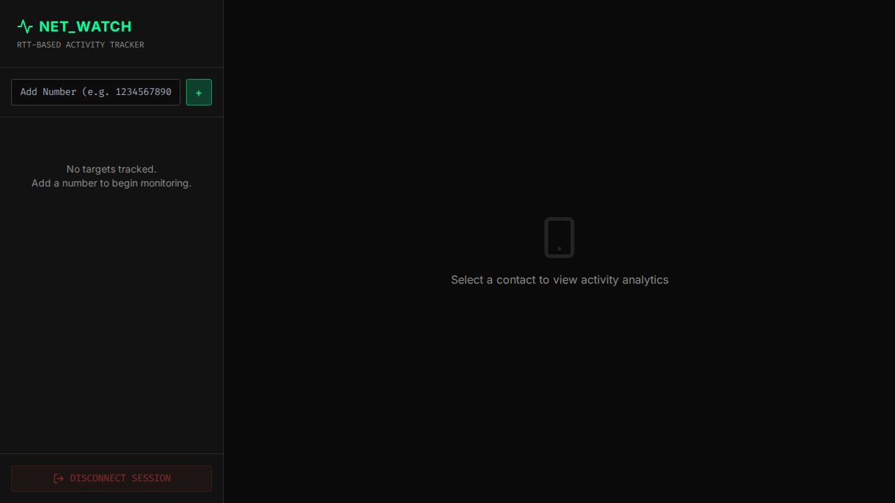

# Device Activity Tracker
Whatsapp Activity Tracker via RTT Analysis

> ⚠️ **DISCLAIMER**: Proof-of-concept for educational and security research purposes only. Demonstrates privacy vulnerabilities in WhatsApp and Signal.

## Overview

This project implements the research from the paper **"Careless Whisper: Exploiting Silent Delivery Receipts to Monitor Users on Mobile Instant Messengers"** by Gabriel K. Gegenhuber, Maximilian Günther, Markus Maier, Aljosha Judmayer, Florian Holzbauer, Philipp É. Frenzel, and Johanna Ullrich (University of Vienna & SBA Research).

**What it does:** By measuring Round-Trip Time (RTT) of WhatsApp message delivery receipts, this tool can detect:
- When a user is actively using their device (low RTT)
- When the device is in standby/idle mode (higher RTT)
- Potential location changes (mobile data vs. WiFi)
- Activity patterns over time

**Security implications:** This demonstrates a significant privacy vulnerability in messaging apps that can be exploited for surveillance.

## Example



The web interface shows real-time RTT measurements, device state detection, and activity patterns.

## Installation

```bash
# Clone repository
git clone https://github.com/gommzystudio/device-activity-tracker.git
cd whatsapp-activity-tracker

# Install dependencies
npm install
cd client && npm install && cd ..
```

**Requirements:**
- Node.js 16+
- npm
- WhatsApp account
- MongoDB (Optional: app will run without it but data won't be saved)

## Usage

### Web Interface (Recommended)

1. **Start Backend:**
   ```bash
   npm run start:server
   ```
   Server runs on `http://localhost:3001`.

2. **Start Frontend:**
   ```bash
   cd client
   npm run dev
   ```
   Frontend usually runs on `http://localhost:5173`.

3. **Connect:**
   - Open the frontend URL.
   - Scan the QR code using WhatsApp (Linked Devices).
   - Once connected, use the sidebar to add a target phone number (e.g., `491701234567`).
   - Use the "Disconnect Session" button to log out and switch accounts if needed.

### CLI Interface

```bash
npm start
```

Follow prompts to authenticate and enter target number.

## Features

- **Real-time RTT Monitoring**: Visual gauge showing current latency.
- **Activity State Detection**: Classifies device as Online, Standby, or Offline.
- **Session Control**: Full control to connect/disconnect WhatsApp sessions via the UI.
- **Data Insights**: Historical timeline and activity heatmaps (requires MongoDB).
- **Privacy-Focused**: Uses silent reaction messages to minimize user disruption.

## How It Works

The tracker sends reaction messages to non-existent message IDs, which triggers no notifications at the target. The time between sending the probe message and receiving the CLIENT ACK (Status 3) is measured as RTT.

Device state is detected using a dynamic threshold:
- **Online**: RTT < Threshold (active usage)
- **Standby**: RTT > Threshold (screen off/background)
- **Offline**: High RTT or no response

Measurements are stored in a history (if DB is connected) and analyzed to show usage patterns.

## Project Structure

```
device-activity-tracker/
├── src/
│   ├── tracker.ts      # Core RTT analysis logic
│   ├── server.ts       # Backend API server
│   └── index.ts        # CLI interface
├── client/             # React web interface
└── package.json
```

## How to Protect Yourself

The most effective protection is to enable "My Contacts" in WhatsApp under Settings → Privacy → Advanced. This prevents unknown numbers from sending you messages (including silent reactions). Disabling read receipts helps with regular messages but does not protect against this specific attack. As of December 2025, this vulnerability remains exploitable in WhatsApp and Signal.

## Ethical & Legal Considerations

⚠️ For research and educational purposes only. Never track people without explicit consent - this may violate privacy laws. Authentication data (`auth_info_baileys/`) is stored locally and must never be committed to version control.

## Citation

Based on research by Gegenhuber et al., University of Vienna & SBA Research:

```bibtex
@inproceedings{gegenhuber2024careless,
  title={Careless Whisper: Exploiting Silent Delivery Receipts to Monitor Users on Mobile Instant Messengers},
  author={Gegenhuber, Gabriel K. and G{\"u}nther, Maximilian and Maier, Markus and Judmayer, Aljosha and Holzbauer, Florian and Frenzel, Philipp {\'E}. and Ullrich, Johanna},
  year={2024},
  organization={University of Vienna, SBA Research}
}
```

## License

MIT License - See LICENSE file.

Built with [@whiskeysockets/baileys](https://github.com/WhiskeySockets/Baileys)

---

**Use responsibly. This tool demonstrates real security vulnerabilities that affect millions of users.**

